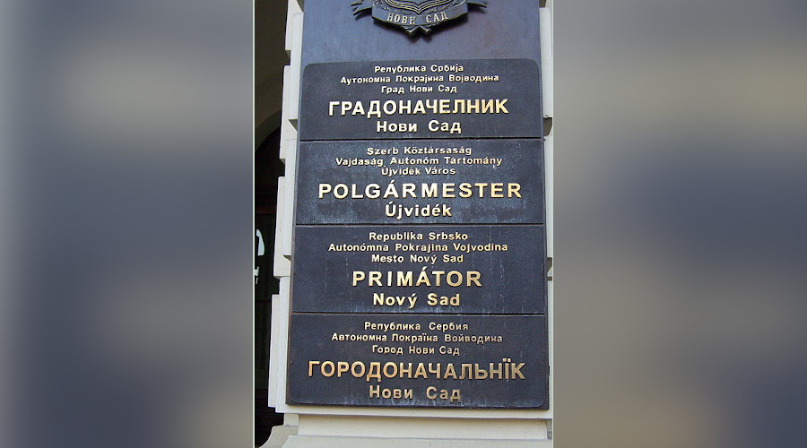
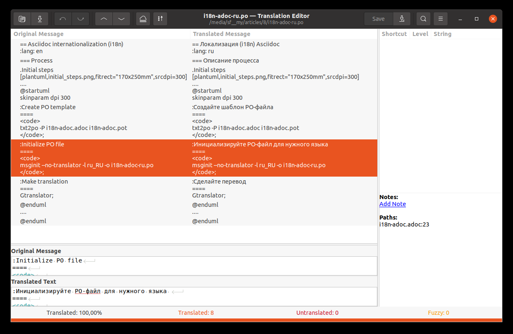

= Simple text markup internationalization (i18n): Gettext approach
Nikolaj Potashnikov
1.0, 2022-01-11
:lang: en
:toc:
:toc-title: Table of contents

ifdef::backend-html5,backend-fodt[]

endif::[]
ifdef::backend-docbook5[]
image::https://habrastorage.org/webt/xr/jz/pb/xrjzpblczowgylzxmvefrjjt4og.jpeg[width=100%]
endif::[]

== Introduction

https://habr.com/ru/post/599775/[Перейти к русской версии]

Several years ago my colleague posted an https://dzone.com/articles/presentation-as-code-why-i-abandoned-powerpoint[article] about making presentations in https://asciidoctor.org/[Asciidoctor]. Since then, we don't use any other approach.

Some time ago there have appeared a problem of translating presentations into several languages and have them synchronized. The solution appeared to be so simple and mature that I decided to describe it in this post.

This solution is syntax-unaware. This means, it doesn't matter whether we use Asciidoc, other light text markup or even mixed format (with my favourite Plantuml or any other diagrams, for example). The serious limitations of this approach are (1) the translator shouldn't break markup structure and (2) we can't directly apply machine translation to the original text.

The solution uses http://docs.translatehouse.org/projects/translate-toolkit/en/latest/[Translation Toolkit] and standard https://www.gnu.org/software/gettext/[GNU Gettext tools].

To make this solution clear this article has English and Russian versions. https://github.com/fiddlededee/asciidoc-i18n[Its repository] contains some simple automation that synchronizes translation, creates printing version (pdf, docx, odt) and creates Markdown file for publishing to Habr.

In my recent article on testing documentation I didn't pay much attention to text linters, because the focus was on approaches, not exact tools. Still these tools are great. To fill the gap I'll use https://github.com/errata-ai/vale[vale] for this article.

== The idea

Gettext assumes that key strings for translation are original messages.

Gettext uses files with `.po` extension (PO -- https://www.gnu.org/software/gettext/manual/html_node/PO-Files.html#PO-Files[Portable Object]) to keep both original and translated messages. A great number of editors allow to edit such files either in a single user or collaborative environments.

The idea of Translation Toolkit is to use blocks of adjacent lines as such strings.

Take this example:
----
.Winter is

* snow
* frost

* Christmas
* New Year
----

It has three block of adjacent string. Translation Toolkit will extract three key strings for translation and will put it to file with `.pot` extension (`.pot` stands for `.po` Template).

Putting or removing line breaks in this example you may make any number of strings from 1 to 5. This depends on convenience to the translator.

Using `.pot` file as a template Gettext creates (updates) `.po` files for all required languages. Translators handle exactly these files. After that Translation Toolkit takes (1) `.po` file with translation, (2) the original file and creates a final translated file.

== The Process

The process consists of the following steps.

* Initial steps to get initial translations in one or several languages.
* Updating translation steps to synchronize translation with the modified original text.

The following diagrams assume that the original file is `i18n-adoc.adoc` and the translation goes to `i18n-adoc-ru.adoc`.

=== Initial steps

.Initial steps

ifdef::backend-html5,backend-fodt[]
[plantuml,initial_steps,fitrect="170x250mm",srcdpi=300, width=80%]
....
@startuml
skinparam dpi 300

:Create //.po// template with **Translation Toolkit**
====
<code>
txt2po -P i18n-adoc.adoc i18n-adoc.pot
</code>;

:Initialize //.po// file with **Gettext**
====
<code>
msginit --no-translator -l ru_RU -o i18n-adoc-ru.po
</code>;

:Make translation with any //.po// editor
====
Gtranslator, Poedit etc.;

:Create (update) the translated file with **Translation Toolkit**
====
<code>
po2txt -t i18n-adoc.adoc i18n-adoc-ru.po i18n-adoc-ru.adoc
</code>;

@enduml
....
endif::[]

ifdef::backend-docbook5[]
image::https://habrastorage.org/webt/0u/rs/zp/0urszpwyr0va0baicqejdrhr7vq.png[fitrect="170x250mm",srcdpi=300,width=80%]
endif::[]

There is a vast number of editors for translating `.po` files. The following screenshot shows https://wiki.gnome.org/Apps/Gtranslator[Gtranslator] interface. I prefer https://poedit.net/[Poedit], although the way it replaces backtick with tick while applying machine translation is annoying.

.Translating in Gtranslator

ifdef::backend-html5,backend-fodt[]

endif::[]

ifdef::backend-docbook5[]
image::https://habrastorage.org/webt/xe/yp/8q/xeyp8qzjmsdohjrmrccmoojupgo.png[width=100%]
endif::[]

=== Updating translation

.Updating translation

ifdef::backend-html5,backend-fodt[]
[plantuml,updating-translation,fitrect="170x250mm",srcdpi=300,width=80%]
....
@startuml
skinparam dpi 300

:Recreate //.po// template with **Translation Toolkit**
====
<code>
txt2po -P i18n-adoc.adoc i18n-adoc.pot
</code>;

:Merge //.po// template with the existing //.po// file with **Gettext**
====
<code>
msgmerge -U i18n-adoc-ru.po i18n-adoc.pot
</code>;

:Update translation with any //.po// editor
====
Gtranslator, Poedit etc.;

:Create (update) the translated file with **Translation Toolkit**
====
<code>
po2txt -t i18n-adoc.adoc i18n-adoc-ru.po i18n-adoc-ru.adoc
</code>;

@enduml
....
endif::[]

ifdef::backend-docbook5[]
image::https://habrastorage.org/webt/um/ff/n3/umffn3yakhg2w72zm4xwbos_rki.png[fitrect="170x250mm",srcdpi=300,width=80%]
endif::[]

== Some notes

. In our documentation we often reuse source i18n strings just to be sure that names of interface elements in documentation are equal to the same names in our application. We generate these i18n strings automatically in the following format:
+

----
:main-menu-documents: Documents
:main-menu-documents-my: My
...
----
+

We include such a file in the Asciidoc document like `include i17n-\{lang}.adoc[]`. Now there is no need to use attributes. Just translate `include i17n-en.adoc[]` to `include i17n-ru.adoc[]`.

. When `gettext` updates `.po` files it uses fuzzy search. If you slightly change the original text you won't lose its translation. It will be just marked as flaky.

. It's easy to check whether translation file is up-to-date with a Gettext utility `msgfmt`.
+

----
msgfmt --statistics i18n-adoc-ru.po
----
+

It shows the number of translated strings, the number of strings that need checking and the number of untranslated strings.

== Conclusion

* Translation Toolkit and Gettext make the process of documentation internationalization quite efficient.

* Simple text markups are not so simple. To take full advantage of it one needs a certain level of skills. Try to give translator `.po` files. Will they be ready to make a translation? Or they'll ask you for text in a more traditional format like Microsoft Word.

* Quality control: 58 translated messages, 0 errors, 0 warnings and 0 suggestions in 1 file.